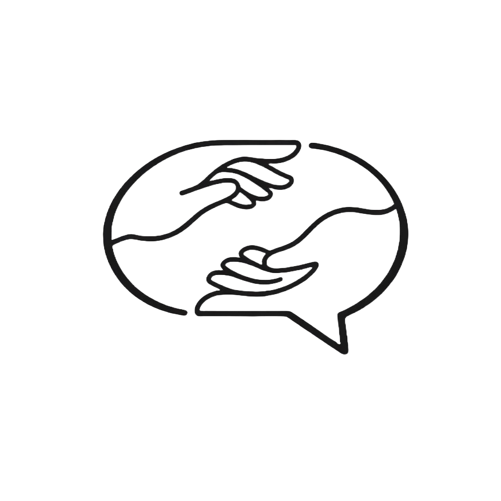

<div align="center">
  

  # NOIMA — Greek Sign Language Recognition

  Real-time isolated word recognition for Greek Sign Language (GSL),
  powered by a hybrid Conv1D + Transformer model and MediaPipe keypoints.

  
  
  
  
</div>

---

## Overview

NOIMA (Greek: ΝΟΗΜΑ, meaning "sign/meaning") is a browser-based AI tool that recognizes **310 Greek Sign Language words** in real time using your webcam. It extracts body keypoints with MediaPipe, feeds them through a custom deep learning model, and displays predictions live in the browser.

The project includes:
- A **FastAPI backend** serving inference and a sign library
- A **bilingual web UI** (Greek / English) with live skeleton visualization
- A **pretrained model** (`noima_v2plus_best.pt`, ~12 MB) ready to use out of the box

---

## Features

- **Real-time webcam inference** — detects sign boundaries automatically and predicts on completed signs
- **Top-5 confidence display** — shows ranked predictions with confidence scores
- **Sign library** — browse all 310 supported signs with example GIFs
- **Bilingual UI** — full Greek and English interface
- **REST API** — endpoints for programmatic access
- **CPU + GPU support** — runs on CPU; uses CUDA automatically if available

---

## Architecture — NOIMAv2+

The model processes raw MediaPipe keypoints through a multi-stage pipeline:

```
Webcam frames
    │
    ▼
MediaPipe Holistic
    │  225-dim keypoints/frame
    │  (11 pose + 21L hand + 21R hand + 22 face landmarks, x/y/z)
    ▼
Feature Engineering                          [features.py]
    │  Drop z → 150-dim (x/y only)
    │  Per-sequence normalization (0-mean, 1-std)
    │  + velocity (dx) + acceleration (dx²) → 450-dim
    │  Pad/resample to 64 frames
    ▼
Body-Part MLPs (×4)                          [model.py]
    │  Separate MLP for: Pose | Left hand | Right hand | Face
    │  Max-aggregate both hands → fused 256-dim embedding
    ▼
3× Conv1DBlock + TransformerBlock (×2)
    │  Conv1D (kernel=17, depthwise) + ECA attention + Mish
    │  Multi-head self-attention (8 heads) with padding mask
    ▼
Masked mean-pooling over time
    ▼
Classification head → 310 classes
```

**Model stats:** ~6.5M parameters · 12 MB checkpoint · 64-frame input window

---

## Training

The model was trained on the [GSL Isolated dataset](https://vcl.iti.gr/dataset/gsl/) (IIT/VCL), containing isolated sign videos for 310 Greek glosses.

| Setting | Value |
|---|---|
| Optimizer | AdamW (lr=3e-4, weight_decay=0.4) |
| LR schedule | Cosine decay with 10-epoch linear warmup |
| Loss | Label-smoothed CE (0.3) + OUSM (k=3) |
| Augmentation | Manifold Mixup (p=0.5, α=0.4) |
| Regularization | Model Soup (checkpoint averaging, epoch 100+) |
| Max epochs | 150 (early stopping, patience=30) |
| Batch size | 128 |

**Results on GSL isolated test set:**

| Metric | Accuracy |
|---|---|
| Top-1 | ~95% |
| Top-5 | ~98% |

Full training script: [`noima_development.ipynb`](noima_development.ipynb)

---

## Installation

**Requirements:** Python 3.10+, pip

```bash
git clone https://github.com/alexiou-alexandros/noima.git
cd noima
pip install -r requirements.txt
```

> **Note:** MediaPipe is pinned to `0.10.14` for compatibility. A virtual environment is recommended.

---

## Usage

### Windows (easiest)
Double-click **`run.bat`** — the server starts and your browser opens automatically.

### Any platform
```bash
python main.py
```
Then open **http://localhost:8000** in your browser.

---

## API Reference

| Endpoint | Method | Description |
|---|---|---|
| `/predict` | POST | Inference from client-side keypoints array |
| `/predict_gif/{gloss}` | GET | Top-5 predictions on a sign's example GIF |
| `/gif_frames/{gloss}` | GET | Extract frames + landmarks + prediction from a GIF |
| `/signs` | GET | List all signs that have example GIFs available |

**`/predict` request body:**
```json
{
  "keypoints": [[...], [...]]  // (T, 225) float array
}
```

**Response:**
```json
{
  "gloss": "ΚΑΛΗΜΕΡΑ",
  "confidence": 0.94,
  "top5": [
    {"gloss": "ΚΑΛΗΜΕΡΑ", "confidence": 0.94},
    ...
  ]
}
```

---

## Dataset & License

**Code:** MIT License — see [LICENSE](LICENSE)

**Model weights** (`noima_v2plus_best.pt`) were trained on the [GSL Isolated dataset](https://vcl.iti.gr/dataset/gsl/) provided by IIT/VCL (Adaloglou et al.). The dataset does not carry a clearly stated open license. If you wish to use the pretrained weights for redistribution or commercial purposes, please contact the dataset authors at adaloglou@iti.gr.

**Sign example GIFs** (`sign_videos/samples/`) are derived from the same dataset and carry the same licensing considerations.

---

## Acknowledgements

- **GSL Dataset** — Provided by [IIT/VCL](https://vcl.iti.gr/dataset/gsl/). If you use this project in research, please cite the original dataset paper:

  > Adaloglou, N., Chatzis, T., Papastratis, I., Stergioulas, A., Papadopoulos, G.Th., Zacharopoulou, V., Xydopoulos, G.J., Atzakas, K., Papazachariou, D., & Daras, P. (2020).
  > *A Comprehensive Study on Sign Language Recognition Methods.*
  > arXiv:2007.12530

  ```bibtex
  @article{adaloglou2020comprehensive,
    title={A Comprehensive Study on Sign Language Recognition Methods},
    author={Adaloglou, Nikolas and Chatzis, Theocharis and Papastratis, Ilias and
            Stergioulas, Andreas and Papadopoulos, Georgios Th and Zacharopoulou, Vassia and
            Xydopoulos, George J and Atzakas, Klimnis and Papazachariou, Dimitris and Daras, Petros},
    journal={arXiv preprint arXiv:2007.12530},
    year={2020}
  }
  ```

- Architecture inspired by top solutions from the [Kaggle GISLR competition](https://www.kaggle.com/competitions/asl-signs)
- [MediaPipe](https://github.com/google/mediapipe) for real-time pose/hand/face estimation
